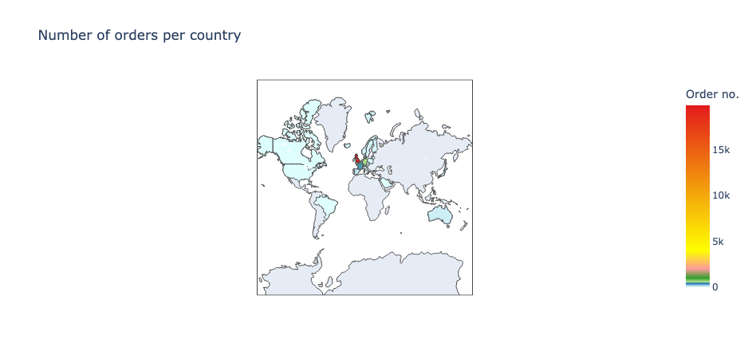

# Project: E-Commerce-Customer-Segmentation-Project

## Description

Analysis of an `E-Commerce customer database` that lists purchases made by over 4000 customers over a period of one year, I developed a model that allows to anticipate the purchases that will be made by a `new customer`, during the following year, from its first purchase.

## Business Use-case Overview
`Customer segmentation` is the practice of dividing a customer base into groups of individuals that are similar in specific ways relevant to `marketing`, such as `age`, `gender`, `interests` and `spending habits`. and also be seen as the practice of dividing a `company’s customers` into groups that reflect similarity among customers in each group. The goal of segmenting customers is to decide how to relate to customers in each segment in order to maximize the value of each customer to the business

Companies employing customer segmentation operate under the fact that every customer is different and that their `marketing efforts` would be better served if they `target specific`, `smaller groups` with messages that those costomers would find relevant and lead them to buy something. Companies also hope to gain a `deeper understanding` of their `customers' preferences` and needs with the idea of discovering what each segment finds most valuable to more accurately `tailor marketing materials` toward that segment.

Customer segmentation relies on identifying key differentiators that divide customers into groups that can be targeted. Information such as a customers' demographics (age, race, religion, gender, family size, ethnicity, income, education level), geography (where they live and work), psychographic (social class, lifestyle and personality characteristics) and behavioral (spending, consumption, usage and desired benefits) tendencies are taken into account when determining customer segmentation practices.

## Data
The customer segments data is included as a selection of app. 4000 data points collected on data found from an E-Commerce database, which was gotton from UCI Machine Learning Repository. You use this data in your local machine, you have to clone and unzip the `data.csv` file from this Repo.  

### Features
This dataframe contains 8 variables that correspond to:

1. **InvoiceNo**:  Invoice number. `Nominal`, a `6-digit integral` number uniquely assigned to each transaction. If this code starts with letter `'c'`, it indicates a cancellation.
2. **StockCode**: Product (item) code. `Nominal`, a `5-digit integral` number uniquely assigned to each distinct product.
3. **Description**: Product (item) name. `Nominal`.
4. **Quantity**:  The quantities of each product (item) per transaction. Numeric.
5. **InvoiceDate**: `Invoice Date` and `time`. `Numeric`, the day and time when each transaction was generated.
6. **UnitPrice**: `Unit price`. `Numeric`, `Product price` per unit in sterling.
7. **CustomerID**: `Customer number`. `Nominal`, a 5-digit integral number uniquely assigned to each customer.
8. **Country**: `Country name`. `Nominal`, the name of the country where each customer resides.

#### DataFrame 

# Data Exploration

From the Map, You'll see that the dataset is largely dominated by orders made from this first five Countries

* `United Knigdom` with `19857` customers
* `Germany` with `603` customers
* `France` with `458` customers
* `EIRE` with `319` customers
* `Belgium` with `119` customers

#### Distribution of Order Amount

#### Keywords Word Occurence 

#### Silhouette intra-cluster score

#### Product Content Word cloud

#### PCA Vs Explained Variance

#### PCA Customer category analysis

#### Customers morphology

#### Classifiers and respective learning curves

# Conclusion

The work described in this notebook is based on a `database` providing details on purchases made on an `E-commerce` platform over a period of one year. Each entry in the dataset describes the purchase of a `product`, by a `particular customer` and at a given `date`. In total, approximately  `∼4000 clients` appear in the database. Given the available information, I decided to develop a `classifier` that allows to anticipate the type of purchase that a customer will make, as well as the number of visits that he will make during a year, and this from its first visit to the `E-commerce site`.

The first stage of this work consisted in describing the `different products` sold by the `site`, which was the subject of a first classification. There, I grouped the different products into `5 main categories of goods`. 

In a second step, I performed a `classification of the customers` by analyzing their consumption habits over a period of `10 months`. I have classified clients into `11 major categories` based on the type of products they usually buy, the number of visits they make and the amount they spent during the 10 months. Once these categories established, I finally trained several classifiers whose objective is to be able to classify constomers in one of these `11 categories` and this from their first purchase. For this, the classifier is based on `5 variables` which are:

* **mean**: amount of the basket of the current purchase

* **categ_N** with **N∈[0:4]**: percentage spent in product category with index  **N**

Finally, the quality of the `predictions` of the different `classifiers` was tested over the last two months of the dataset. 

The data were then processed in two steps:

`first`, all the data was considered (over the `2 months`) to define the category to which each client belongs, and then, the classifier predictions were compared with this category assignment. I then found that `75%` of clients are awarded the right classes. The performance of the classifier therefore seems correct given the potential shortcomings of the current model. In particular, a bias that has not been dealt with concerns the seasonality of purchases and the fact that purchasing habits will potentially depend on the time of year (for example, `Christmas`). 

In practice, this seasonal effect may cause the categories defined over a `10-month` period to be quite different from those extrapolated from the last two months. In order to correct such bias, it would be beneficial to have data that would cover a longer period of time.

  

